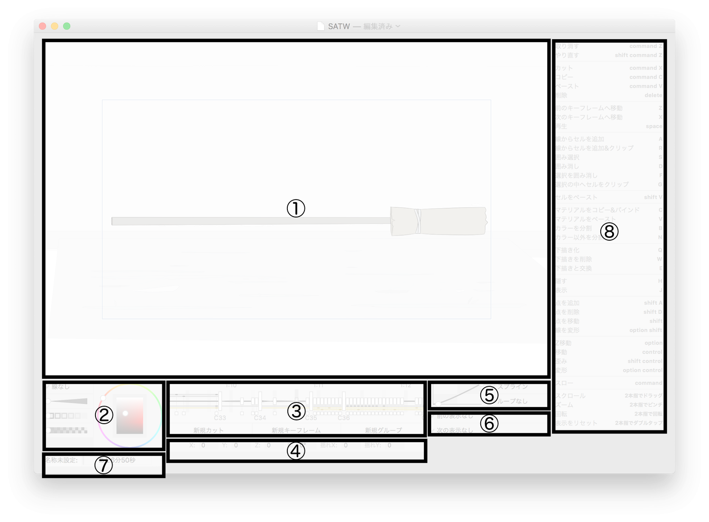

# ヘルプ

## 1. キャンバス
書き出しの対象となるのは青枠内のみです。ドラッグすると線を引くことができます。下描き層は薄い青色の線で表示され、他のグループの線やセルの表示は半透明で表示されます。

セルを指し示した場合、セルの線が青く表示されます。セルのマテリアルをバインドした場合、そのマテリアルと同一のマテリアルを持ったセルの外側にオレンジ色の線が表示され、マテリアルのカラーと同一のカラーを持ったセルの外側に薄いオレンジ色の線が表示されます。

セルをクリックした場合、セルが編集状態になります（以下、編集セルと呼びます）。編集セルは最初の線の向きが矢印として表示され、また、線の端が他の線と接合している場合は白丸、していない場合は黒丸がその線の端に表示されます。

コマンドなどの適用範囲は、選択したセルを指し示した場合は選択したセルすべて、通常のセルを指し示した場合はそのセルだけです。

## 2. マテリアル・プロパティ
マテリアル・プロパティを指し示している間、キャンバスはプレビュー表示に変わります。

### タイプ

**通常:**  
線と平面を描画。

**線なし:**  
平面のみを描画。

**ぼかし:**  
外側にぼかしを入れた平面を描画。

**光沢:**  
ぼかしを乗せた平面を加算合成で描画。

**発光:**  
外側にぼかしを入れた平面を加算合成で描画。

**スクリーン:**  
外側にぼかしを入れた平面をスクリーン合成で描画。

**乗算:**  
外側にぼかしを入れた平面を乗算合成で描画。

### 線の太さ
セルの線の太さを変更できます。右へスライドさせるほど線が太くなります。

### 線の色の強さ
セルの線の色の強さを変更できます。範囲は黒色から平面の色までの間で、右へスライドさせるほど、平面の色に近づきます。

### 透明度
セルの透明度を変更できます。右へスライドさせるほど色が透明に近づきます。

### カラーピッカー
セルの平面の色を変更できます。外側の輪が色相、内側の正方形の横が彩度、縦が輝度になります。

## 3. タイムライン
タイムラインの上側の数字は時間、下側のC1, C2, C3...はカット番号です。キーフレームのつまみ、またはカットのつまみをドラッグすることによりそれぞれの時間を変更できます。

グループが追加されて1つのカットに2つ以上になったときは、タイムラインの軸の上下にグループ線が引かれ、また、全体のキーフレーム編集のためのつまみが出現します。

左右のスクロールで時間、上下のスクロールでグループの移動ができます。編集時間、編集グループの位置は必ず中心に来るようになっています。

**新規カット:**  
新規カットを編集中のカットの次に挿入し、新規カットの先頭時間へ移動します。

**新規キーフレーム:**  
編集グループを新規キーフレームで分割します。

**新規グループ:**  
新規グループを編集グループの下側に挿入し、新規グループを編集状態にします。
    
**下描き化:**  
編集グループに引かれた線をそのグループの下描き層に移動します。線を選択している場合、その線のみを下描き層に移動します。
    
**下描きを削除:**  
下書き層にある線を削除します。

**下描きと交換:**  
編集中のグループに引かれた線と下書き層の線と交換します。

## 4. カメラ・プロパティ
**X:, Y:, Z:**  
カメラの位置を変更できます。

**θ:**  
カメラの角度を変更できます。

**揺れX:, 揺れY:**  
カメラの振動を変更できます。値が0より大きい場合、キャンバスに赤枠でその振動の最大範囲を表示します。

## 5. キーフレーム・プロパティ

### イージング
横軸が時間、縦軸が補正後の時間のグラフです。2つの制御点を動かすことでイージングを編集できます。

### 補間
**スプライン:**  
補間対象の2つのキーフレームとその前後2つのキーフレームを使って滑らかに補間します。  
もし前後両方のキーフレームが存在しない場合、リニア補間になります。

**バウンド:**  
ボールがバウンドするときなど、軌道を急に変化させたい場合にこの補間を使います。

前後のキーフレームのうち、前のキーフレームを使わずにスプラインで補間します。また、前のキーフレームでは次のキーフレーム（設定したキーフレーム）を使わずにスプラインで補間します。

**リニア:**  
補間対象の2つのキーフレームのみを使ってリニア補間します。

**補間なし:**  
次のキーフレームまで値が変化しません。

### ループ

**ループなし／ループ開始／ループ終了:**  
「ループ開始」が設定されたキーフレームから「ループ終了」が設定されたキーフレームの間をループします。ループ時間は「ループ終了」が設定されたキーフレームの時間から次のキーフレームの時間までです。

ループは重ねて設定することが可能です。

## 6. シーン・プロパティ

### 前後表示
**前の表示なし／前の表示あり:**  
前のキーフレームの線画を表示するかどうか切り替えます。編集カット以外のキーフレームは対象になりません。

**次の表示なし／次の表示あり:**  
次のキーフレームの線画を表示するかどうか切り替えます。編集カット以外のキーフレームは対象になりません。

## 7. 書き出しプログレスバー
書き出しの進捗を表示します。書き出し中の時のみ表示されます。取り消すには指し示したプログレスバーに「削除」コマンドを適用します。

## 8. コマンド
「shift」のみなど、英数字キーを使わないコマンドは一時的なモードであり、そのキーを押しながらドラッグを行うことによって動作します。

### コマンドの一覧

**取り消す:**  
一段階だけ操作を取り消します。

**やり直す:**  
一段階だけ操作の取り消しを取り消します。

---

**カット:**  
「コピー」のあとに「削除」を適用します。

**コピー:**  
指し示したオブジェクトをクリップボードへコピーします。

**ペースト:**  
クリップボードにあるオブジェクトを表示に合わせてペーストします。セルの場合、同じIDのセルの線がペーストセルの線に置き換えられます。

**削除:**  
指し示したオブジェクトを削除します。スライダーなど初期値を持つ場合は初期値に戻ります。

---

**前のキーフレームへ移動:**  
前のキーフレームがない場合、前のカットの最後のキーフレームに移動します。前のキーフレームがある場合、そのキーフレームに移動します。

**次のキーフレームへ移動:**  
次のキーフレームがない場合、次のカットの最後のキーフレームに移動します。次のキーフレームがある場合、そのキーフレームに移動します。

**再生:**  
再生表示に切り替えます。再生を停止するにはキャンバスをクリックします。

---

**線からセルを追加:**  
複数の線を使ってセルを追加します。線の間が交差しないように結ばれ、その結んで閉じた領域を平面としてセルを生成します。

〜編集セルが存在する場合〜
編集セルの線を作画層の線を使って置き換えます。

編集セルの前中後表示には一番目の線として矢印が書かれており、その矢印が線の方向を示します。その最初の順番と線の向きさえ合わせれば他のキーフレームのセルと崩れることなく補間が可能になります。
最初の順番と最初の線の向き以外はどんな順番や向きで線を引いても問題はありません。

線は合わせた他の線の制御点の数に揃うように修正されます。

**線からセルを追加&クリップ:**  
「線からセルを追加」と同様にセルを生成したあと、追加するセルを指し示したセルにクリップします。もし他のグループに選択があり、その選択を指し示した場合は、その選択セルを合わせたセル群にクリップします。

**囲み選択:**  
最後に引かれた線で囲まれた線やセルを選択します。囲み線は使用後に削除されます。

**囲み消し:**  
最後に引かれた線で囲まれた線やセルを削除します。囲み線は使用後に削除されます。

線の場合、囲んだ領域が消えるように分割して削除します。セルの場合、セルの線が含む場合はセルを削除し、セルの平面のみ含む場合はセルを削除し、線を作画層に戻します。

**選択を囲み消し:**  
最後に引かれた線で囲まれた線やセルの選択を削除します。囲み線は使用後に削除されます。

**選択の中へセルをクリップ:**  
指し示したセルを選択の中にクリップします。選択がない場合は指し示したセルのクリップを解除します。

---

**セルをペースト:**  
コピーした複数のセルを完全に複製してペーストします。

---

**マテリアルをコピー&バインド:**  
指し示したセルのマテリアルをコピーし、さらにマテリアル表示へバインドします。

**マテリアルをペースト:**  
指し示したセルへマテリアルをペーストします。

**カラーを分割:**  
指し示したセルのカラーのIDを新しく振り分けます。複数選択しているセルのカラーを分割する場合、その選択内の同一カラーの関係は保たれます。

**カラー以外を分割:**  
指し示したセルのマテリアルのIDをカラーのIDを変えずに新しく振り分けます。複数選択しているセルのマテリアルを分割する場合、その選択内の同一マテリアルの関係は保たれます。

---

**隠す:**  
キャンバス上では指し示したセルを半透明表示にします。半透明表示になったセルは判定がなくなり、下側のセルを指し示たりクリックで選択することができるようになります。タイムライン上では編集グループを隠します。    

**表示:**  
キャンバス上ではすべてのセルを表示します。タイムライン上では編集グループを表示します。

---

**点を追加:**  
指し示した線の制御線を半分に分割する制御点を追加します。

**点を削除:**  
指し示した線の制御点を削除します。

**点を移動:**  
指し示した制御点をドラッグで移動できます。移動する点が線端である場合、他の線端に十分近づくとその線端に吸着します。

**線を変形:**  
指し示した線端をドラッグで移動できます。線端が他の線端と同じ位置にある場合、他の線端も一緒に移動します。

---

**Z移動:**  
指し示したセルの重なり順を変更することができます。

**移動:**  
キャンバスの場合、指し示したセルをドラッグで移動できます。タイムラインの場合、グループを上下ドラッグでグループの順番を変更できます。

**歪み:**  
指し示したセルをドラッグで歪まることができます。

**変形:**  
指し示したセルを選択したプロパティで変形できます。プロパティの選択はドラッグで選択できます。

---

**スロー:**  
キャンバス上ではストロークの編集点の間隔が広くなり、カーブなどが引きやすくなります。カラーピッカー上ではドラッグのスピードが遅くなり、より精密にコントロールできます。

---
下記の操作はトラックパッドのジェスチャーでのみ対応しています。トラックパッドでの操作はOSの「環境設定」に依存します。

**スクロール:**  
キャンバス上ではxyの移動、タイムライン上では左右のスクロールで時間、上下のスクロールでグループの移動ができます。

**ズーム:**  
キャンバス上では拡大縮小、タイムライン上では1フレームあたりの表示の大きさが変更できます。

**回転:**  
キャンバスを回転できます。キャンバスのみ対応です。

**表示をリセット:**  
上記のジェスチャーで行った表示の変更を最初の状態に戻します。ただし、時間の移動はリセットされません。
