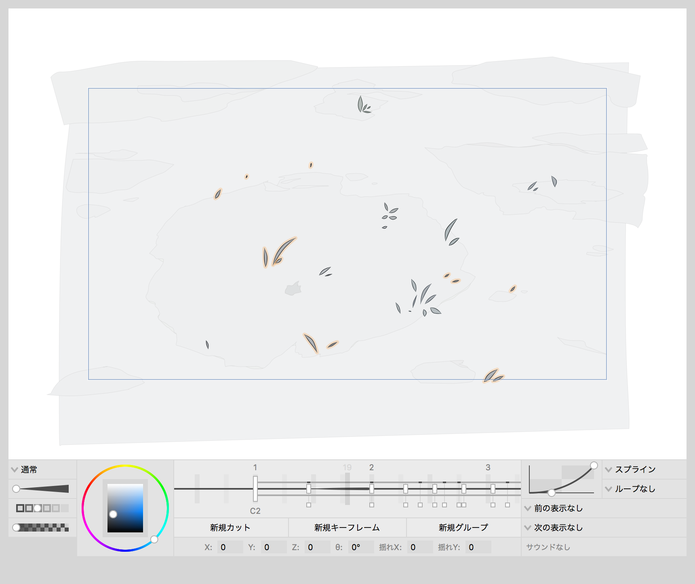

# C0
モードレスなmacOS専用の2Dアニメーション制作ツール

最新版ダウンロード: [v0.1.0 (β版)](https://github.com/smdls/C0/releases/download/v0.1.0/C0-0.1.0.dmg)

## 特徴

### モードレス
認知工学に基づき、あることを行う方法が基本的に一通りしかない単調性を持ち、さらにそこにモードが存在しないモードレスな設計になっています。また、オブジェクト指向に従った非タスク的な設計論に基づいており、創造性に特化した、創造のためのツールです。

### モードレス・ドローイング
モードレスな設計に基づき、再生の時以外はキャンバス上では常にストロークであり、またそのストロークには常に同じ太さと色の線が使われます。モードの代わりに、工学上問題のない運動神経を使った一時的なモードとコマンドの適用によって線をコントロールします。

### インディケーション
モードレスな設計とオブジェクト指向に基づき、選択ではなく指し示したオブジェクトにコマンドを適用します。選択を指し示した場合はその選択群にコマンドを適用します。基本的にこのソフトウェア上では指し示した「オブジェクト（名詞）」に「コマンドを適用（動詞）」する、つまり「名詞→動詞パターン」のみで成り立つように設計しています。

### 技法的な自動作画補間
非タスクな設計に基づき、機能として「自動作画補間」というものは存在しませんが、技法として従来の中割りや彩色に相当する作業を省略することが可能になっています。

### オーバーシュートのない補間
通常のスプライン補間で発生してしまうオーバーシュートをなくした、より自然でコントロールのしやすい単調性補間を採用しています。

### センター・タイムライン
単調性に基づき、常に時間が中心に来るように設計しました。また、モードレスな設計に基づき、カットを直列表示にし、カットやキーフレームをシームレスに切り替え可能にしました。

### 輝度を軸にしたカラーピッカー
人間の知覚特性を考慮し、より効率的に色を決めれるようにカラーピッカーを設計しました。

### 複雑性の除去
多機能ではなく、単純な機能のみを使って創造する、つまり標準的に単純な表現方法に偏るような設計になっています。これは「単純な作業方法および表現方法の方が、想定し得る絶対的な作業量が減りモードレス作業を増やせる分、ユーザーの創造性を引き出すという意味では有利」という設計思想に基づいています。

### 道具主導の表現
今までの表現をコンピュータ上で再現したわけではなく、また、「こういう表現をしたい」という考えから設計を行ったわけでもありません。このソフトウェアの開発指針では、モードレスに扱えるオブジェクトが存在しているのみとしていて、表現はそこから工夫により生まれるものであるとして設計しています。

## 推奨環境
* macOS 10.11以降
* トラックパッド、ペン入力デバイス（ペンタブレットなど）必須
* Retinaディスプレイ、SSD推奨

## 開発環境
* macOS 10.11.6
* Xcode 8.2.1
* Swift 3.0

## ライセンス
GNU General Public License v3.0

## 開発者
S

* [Twitter](https://twitter.com/smdls)
* [Youtube](https://www.youtube.com/channel/UCQ6kzSlb5Zi6-EvsGcZuDAw)

メール: <smdls001@gmail.com>

## 寄付
[Amazonギフト券](https://www.amazon.co.jp/Amazonギフト券-Eメールタイプ/dp/BT00DHI8G4) または [Apple Store ギフトカード](https://www.apple.com/jp/shop/personalize/electronic?product=E_GIFT_CARDS)

受取人のEメールアドレス: <smdls001@gmail.com>
